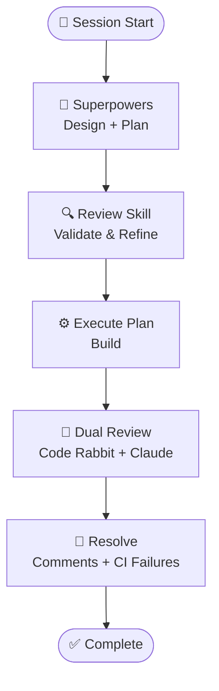

# Claude Plugin Marketplace

A collection of workflow orchestration plugins and development utilities for Claude Code.

## Overview

This repository serves as a marketplace for Claude Code plugins, providing specialized agents, commands, and skills to enhance your development workflow.

## Plugins

### dev-utils
Utility commands for general development tasks.

**Commands**
* `/create-pr`: Commit staged/unstaged changes, push to a new branch if on main, and open a pull request.

* `/review-plan`: Interactively review a plan across architecture, code quality, tests, and performance before writing any code. Works through issues one section at a time with opinionated recommendations and asks for your input before assuming a direction.

* `/resolve-pr-comments`: Fetch all unresolved review threads on the current branch's PR, evaluate each one, apply fixes where warranted, reply, and optionally resolve threads.
  * `--resolve`: resolve each thread after replying
  * `--dry-run`: print the evaluation plan but make no changes

* `/resolve-ci-failures [<pr_number> [<repo>]]`: Show CI failures for a PR, diagnose the root cause, apply fixes, re-run the failing tests to verify, then commit and push. Defaults to the current branch's PR and repo if arguments are omitted.

## Installation

**Add Marketplace**
```
/plugin marketplace add dimagi/dimagi-claude-workflows
```

**Browse Available Plugins**
```
/plugins
```

## Additional plugins

### Skill Plugins

1. [Superpowers](https://github.com/obra/superpowers) - Plan -> Build -> Review workflow
2. [Official Anthropic Claude Plugins](https://github.com/anthropics/claude-plugins-official)
   - commit-commands: Git skills
   - playwright: Browser automation
3. [Context7](https://github.com/upstash/context7): Up-to-date code documentation for LLMs and AI code editors
4. [Humanizer](https://github.com/trailofbits/skills-curated/tree/main/plugins/humanizer): Remove signs of AI-generated writing from text to make it sound natural and human-written.
5. [Visual Explainer](https://github.com/nicobailon/visual-explainer) - Documentation and visualization support

## Workflow Summary



## License

See [LICENSE](LICENSE) for details.
