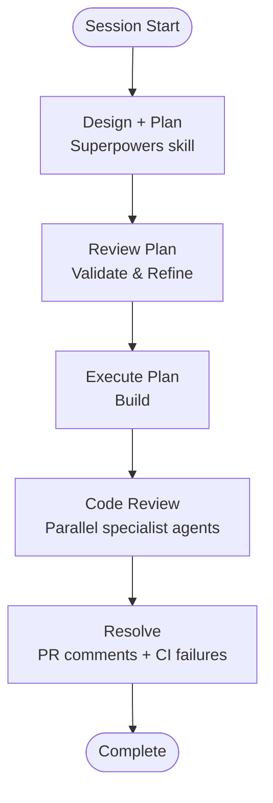

# Claude Code Toolkit

A collection of resources, workflows, and plugins for getting the most out of Claude Code.

## Overview

Claude Code is Anthropic's CLI for AI-assisted software engineering. This repository provides:

- **Plugins** — agents, commands, and skills that extend Claude Code's capabilities
- **Workflow patterns** — opinionated development loops that work well with Claude
- **Curated external resources** — third-party plugins worth knowing about

## Plugins in This Repo

See [plugins/README.md](plugins/README.md) for full documentation, including installation instructions.

| Plugin | What it does |
|--------|-------------|
| [code-review](plugins/code-review/) | 5 parallel specialist agents produce a prioritised code review |
| [dev-utils](plugins/dev_utils/) | Commands for PRs, plan review, and CI/CD |

## External Plugins

### Skill Plugins

- [Superpowers](https://github.com/obra/superpowers) — Plan → Build → Review workflow
- [Official Anthropic Claude Plugins](https://github.com/anthropics/claude-plugins-official) — git commit skills and more
- [Context7](https://github.com/upstash/context7) — Up-to-date library documentation for LLMs
- [Humanizer](https://github.com/trailofbits/skills-curated/tree/main/plugins/humanizer) — Remove AI writing patterns from text
- [Visual Explainer](https://github.com/nicobailon/visual-explainer) — Documentation and visualization
- [Dogfood](https://skills.sh/vercel-labs/agent-browser/dogfood) — Systematic web app exploration and bug finding

## Development Workflow

A proven loop for Claude-assisted development:

## License

See [LICENSE](LICENSE) for details.
