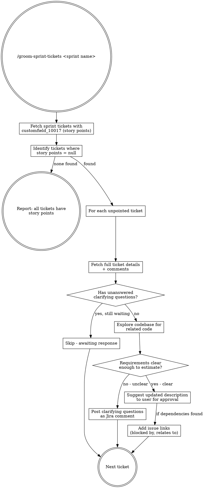

# Groom Sprint Tickets

## Overview

Identifies tickets in a Jira sprint that are missing story points, assesses whether their requirements are clear enough for estimation by examining the ticket details and the codebase, then either posts clarifying questions as a comment or suggests an updated ticket description.

## Usage

```
/groom-sprint-tickets Web Team - Sprint 89
```

The sprint name is passed as the argument. If no argument is provided, ask the user for the sprint name before proceeding.

## Workflow



## Process

### Step 1: Retrieve Sprint Tickets

Query Jira for all tickets in the sprint, including story points:

```
JQL: sprint = "<sprint name>"
Fields: summary, status, issuetype, assignee, customfield_10017
```

**Important:** Story points are stored in `customfield_10017` in the Dimagi Jira instance. This field is NOT listed in field metadata — it only appears when requesting `*all` fields or by explicit name.

Present a summary table of all tickets showing which have/lack story points.

### Step 2: For Each Unpointed Ticket

Fetch the full ticket including comments:

```
Fields: summary, description, parent, issuelinks, comment, components, customfield_10008 (epic link)
```

**Check comments first.** If you previously posted clarifying questions and there is no response yet, skip the ticket and note it as "awaiting response."

If there IS a response to prior questions, proceed to assessment incorporating the answers.

### Step 3: Explore the Codebase

Use the codebase to understand the scope of work described in the ticket:

- Search for views, templates, models, URLs, and tasks mentioned or implied by the ticket
- Identify what exists today vs. what needs to change
- Note any dependencies on other tickets or shared code

This context is critical for assessing whether requirements are specific enough.

### Step 4: Assess Requirement Clarity

Requirements are **clear enough** if:
- Each acceptance criterion maps to identifiable code changes
- The scope boundaries are unambiguous (what's in vs. out)
- Dependencies on other tickets are explicit
- No key decisions are left undefined (e.g., "remove or change" without specifying which)

Requirements **need clarification** if:
- The ticket title contradicts the acceptance criteria (e.g., "reassess" vs "remove")
- Scope is ambiguous (UI-only vs full backend cleanup)
- Dependencies exist but aren't called out
- Key implementation decisions are deferred without clear ownership

### Step 5: Take Action

**If requirements are unclear → Post clarifying questions:**
- Post a numbered list of specific questions as a Jira comment
- Each question should reference what's ambiguous and offer concrete options where possible
- Keep questions scoped to what's needed for estimation, not implementation details

**If requirements are clear → Suggest updated description:**
- Draft an updated description with detailed acceptance criteria
- Place updated scope above the original description, separated by a horizontal rule
- Preserve the original description below for reference
- Present the draft to the user for approval before pushing
- After approval, update the description AND add issue links (e.g., "is blocked by") for any dependencies identified

### Step 6: Report

After processing all unpointed tickets, summarize:
- How many tickets were assessed
- How many had questions posted (awaiting clarification)
- How many had descriptions updated (ready for estimation)
- How many were skipped (already awaiting prior responses)

## Jira Field Reference

| Field | Key | Notes |
|-------|-----|-------|
| Story Points | `customfield_10017` | Not in metadata; must request explicitly |
| Sprint | `customfield_10010` | Array of sprint objects |
| Epic Link | `customfield_10008` | Parent epic key |
| All fields | `["*all"]` | Use when discovering custom fields |

## Common Mistakes

- **Using `customfield_10016` for story points** — Wrong field. Use `customfield_10017`.
- **Updating ticket without user approval** — Always present description changes for review first.
- **Posting questions without codebase context** — Questions grounded in code are more specific and actionable.
- **Ignoring existing comments** — Always check if clarifying questions were already posted and whether responses exist.
- **Putting dependency info only in description** — Use Jira issue links ("is blocked by") for dependencies, not just description text.
