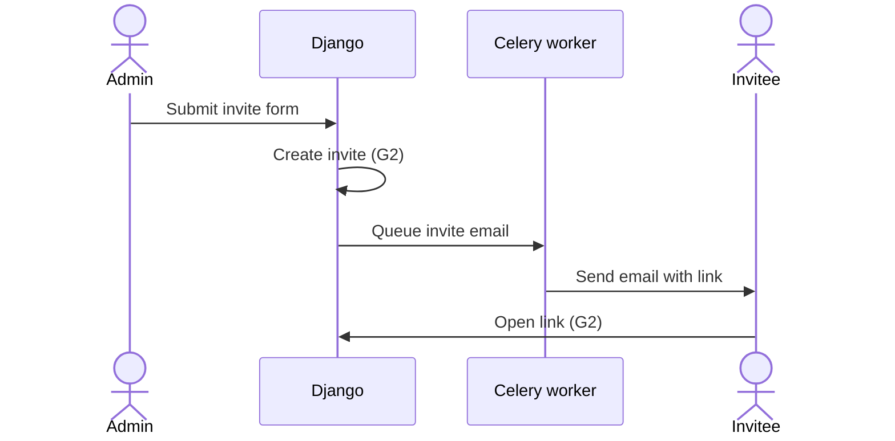

# Spec outline

The spec should use the sections below, in this order. Delete any section or subsection that would be empty. The only place to write "None" is a row in the "At a glance" table.

Every section follows the code names rule in SKILL.md. Explain each code name the first time it appears, and never use one before it has been introduced.

## Overview

No code blocks or code names in this section. Give the reader a mental model to attach the rest of the document to.

- **Problem:** what's wrong or missing today, and why it's worth fixing.
- **Current flow:** how the affected flow works today, from the user's point of view. Leave out if the feature is entirely new.
- **Goals:** a numbered list (G1, G2, …) of what this work must achieve. Later sections cite these IDs.
- **Solution in brief:** one paragraph describing the proposed approach.

## At a glance

One row per area. Write "None" where the feature changes nothing, so a reader can see that the area was checked. Each row links to the section with the details.

This is the first place code names can appear, so each row describes the change in plain words. When a row gives a name, add a short phrase saying what it is.

| Area | Change |
|---|---|
| Django apps | New `example` app, which holds everything about things. |
| Data models | A new model, `Thing`, for things that belong to an opportunity. Opportunities gain a limit on how many things they can have. See [Data model changes](#data-model-changes). |
| URLs and endpoints | Three new pages under `/a/<org_slug>/things` for listing, viewing and editing things. |
| Background work | None |
| External services | None |
| Settings and feature flags | A new setting for the default limit on things per opportunity. |
| Dependencies | None |
| Templates and frontend | New Things list and detail pages. |

## Assumptions

Technical things this spec takes as true that the codebase or the request doesn't state. For each one, say what changes if it turns out to be wrong. Product questions (anything that changes what a user sees or can do) don't belong here. List them as open questions for the product owner.

- **A1.** The assumption. If wrong: what the spec would need to change.

## Data model changes

Give each new, changed or removed model its own heading. Start each one with a one-line **Purpose** saying why the model or change exists. Use tables, not code blocks. List data integrity and validation rules in the Notes column.

### `example.Thing` (new)

**Purpose:** why this model is needed.

| Field | Type | Notes |
|---|---|---|
| `name` | `CharField(max_length=200)` | Unique per opportunity (G1). |

### `opportunity.Opportunity` (changed)

**Purpose:** why this change is needed.

| Field | Change | Notes |
|---|---|---|
| `thing_limit` | Added, `PositiveIntegerField(default=10)` | Why it's needed. |

### Migrations

Data migrations, backfills, and anything that makes a migration slow or not reversible. Leave out if the changes are schema-only.

## Architecture changes

### Django apps

What each new app holds, and what moves between existing apps.

### URLs and endpoints

| Route | View | Purpose | Goals |
|---|---|---|---|
| `/a/<org_slug>/things` | `ThingListView` | Lists an organization's things. | G1, G3 |

### Behaviour

How the main flows work, one heading per flow, citing the goals each one covers. Start each flow with its entry point: who or what starts it, and where. Describe behaviour in plain language. Name code only when the language policy in SKILL.md allows it.

Add a Mermaid diagram when a flow has more than one actor or more than two branches. Use a sequence diagram for steps between actors (user, browser, Django, Celery worker, CommCare HQ, ConnectID) and a flowchart for branching decisions. Put goal IDs in the labels.

#### Inviting a team member (G2)

**Entry:** an organization admin submits the invite form on the organization's members page.

Details the diagram doesn't show, such as validation and error cases.

### Background work and external services

New Celery tasks, periodic jobs, and calls to external services (CommCare HQ, ConnectID, Open Chat Studio, vendors), and what triggers each one. Say how each one behaves when the service is unreachable or not configured.

### Templates and frontend

New layouts, pages and components, links to existing designs (e.g. Claude Design, Figma) etc.

### Settings and feature flags

| Setting or flag | Default | Why |
|---|---|---|
| `THING_LIMIT_DEFAULT` | `10` | Why it's a setting and not a constant. |

### Dependencies

| Package | Why |
|---|---|
| `example-package` | What it's used for. |

## Decisions

Design choices where there was a real alternative. Technical choices only. Product decisions go to the product owner as open questions.

| Decision | Alternative rejected | Reason |
|---|---|---|
| Store the limit on `Opportunity`. | A separate settings model. | Only one value is needed. |

## Risks

What could go wrong while building or running this, and how the spec deals with it.

- The risk, and what the spec does about it.

## Optimization opportunities (optional)

Improvements noticed while designing that this work won't make, such as faster queries, caching or shared code. Say why each one is left out, so later work can pick them up.

- The improvement, where it applies, and why it's deferred.
